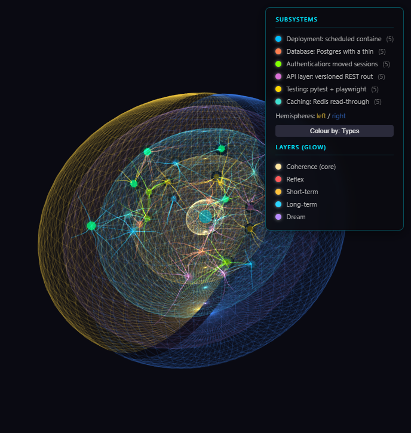

<h1 align="center">Neonmem</h1>

<strong>A living memory <em>cartridge</em> for your AI agent.</strong>

Not a vector database — a self-contained <strong>.neonmem cartridge</strong> that carries a
reasoning graph, a comprehension layer that <em>understands</em> your project, and a small
model trained on your own memory. So your agent learns you and works like a colleague who
actually knows you — remembering every decision, plan, idea and dead-end. Local · private · yours.

  <a href="https://github.com/neonmem-lab/neonmem-app/releases/latest"><strong>⬇ Download for Windows</strong></a>
  ·
  <a href="https://github.com/neonmem-lab/neonmem-app/releases/download/v0.9.2/Neonmem-0.9.2-x86_64.AppImage"><strong>⬇ Linux (AppImage)</strong></a>
  ·
  <a href="https://neonmem.com">neonmem.com</a>
  ·
  <a href="https://neonmem.com/#journeys">See the journeys</a>
  ·
  <a href="https://neonmem.com/report">Report a bug</a>

  

> **Public beta (v0.9.2).** Windows **and Linux** (AppImage) — macOS is on the way.

---

## What it is

Your agent forgets your project between sessions. Neonmem gives it a **living memory
cartridge** — one `.neonmem` file that grows as you work, holds the *why* behind every
decision, and even knows *where you're going*. It's not a vector database; it's a small
mind for your project, and you can watch it form in 3D.

**Three things in one cartridge:**

- 🕸️ **A reasoning graph** — 14 node types and typed edges: observations, decisions,
  dead-ends, rules, and **plans** for where you're heading. The *how* and *why*, not a flat log.
- 🧩 **A comprehension layer** — it clusters everything into **subsystems** and a **resume
  skeleton**, so a fresh session understands the whole project at once instead of scrolling back.
- 🧠 **Models built in** — small, **self-built (no third-party LLM)** models, trained on *your*
  memory, that rank what matters, sense tone, and type what's captured. They travel inside the file.

  

**What that gives you:**

- 🚫 **Remembers dead-ends** — failed approaches stay recorded, so they aren't re-suggested.
- 🧭 **Knows the plan** — immediate next-steps and long-running goals, kept front-of-mind.
- 🌙 **Dreams** — a consolidation pass that decays noise and keeps what matters.
- 🕰️ **Time-travel** — "what did we do three days ago?"
- 👁️ **You can see it** — a real-time 3D brain of memory forming, recalling, consolidating.
- 🔒 **Local & private** — offline, no cloud, no API cost; the cartridge is a portable file you own.
- 🛡️ **Tamper-proof** — binary and agent-write-only by design.

It isn't just for code: the same agent can run a tricky DevOps migration or help
you write a screenplay — and Neonmem remembers all of it. See the full
[journeys](https://neonmem.com/#journeys).

## Works with

| Agent | Status |
|---|---|
| **Claude Code** | ✅ Full support (deliberate memory **+** passive per-turn capture) |
| **GitHub Copilot / VS Code** | 🧪 Experimental (the deliberate memory tools) |
| More agents | 🔜 Coming soon |

## Install

1. **[Download the installer](https://github.com/neonmem-lab/neonmem-app/releases/latest)** (Windows x64).
2. Run it — it detects Claude Code (or point it at your install) and registers
   automatically. Optionally tick **GitHub Copilot (experimental)** for VS Code.
3. Open Claude Code and just work — Neonmem loads your memory at session start.
4. Launch the **Neonmem** app from the Start menu to watch the brain.

Uninstall cleanly from **Add/Remove Programs** (it un-registers itself and keeps
your memory). Misbehaving? `neonmem disable` turns it off without uninstalling.

**On Linux:** grab the
[AppImage](https://github.com/neonmem-lab/neonmem-app/releases/download/v0.9.2/Neonmem-0.9.2-x86_64.AppImage),
`chmod +x` it, and run — no install, no gatekeeper prompt. (Or the
[.tar.gz](https://github.com/neonmem-lab/neonmem-app/releases/download/v0.9.2/neonmem-0.9.2-linux.tar.gz).)

See [RELEASE-NOTES-0.9.2.md](RELEASE-NOTES-0.9.2.md) for what's in this build.

## Report a bug

Full instructions (including where to find your logs) are at
**[neonmem.com/report](https://neonmem.com/report)** — or
[open an issue](https://github.com/neonmem-lab/neonmem-app/issues/new/choose),
or email **support@neonmem.com**.

## License

**Free** for personal, hobby, research, educational and nonprofit use under the
[PolyForm Noncommercial License](LICENSE). **Commercial use requires a license** —
see [COMMERCIAL.md](COMMERCIAL.md) or email **sales@neonmem.com**.

Bundled third-party components keep their own licenses — see
[THIRD-PARTY-NOTICES.md](THIRD-PARTY-NOTICES.md) and
[ACKNOWLEDGEMENTS.md](ACKNOWLEDGEMENTS.md).

> This repository hosts the **downloads and documentation**. The source is not public.
